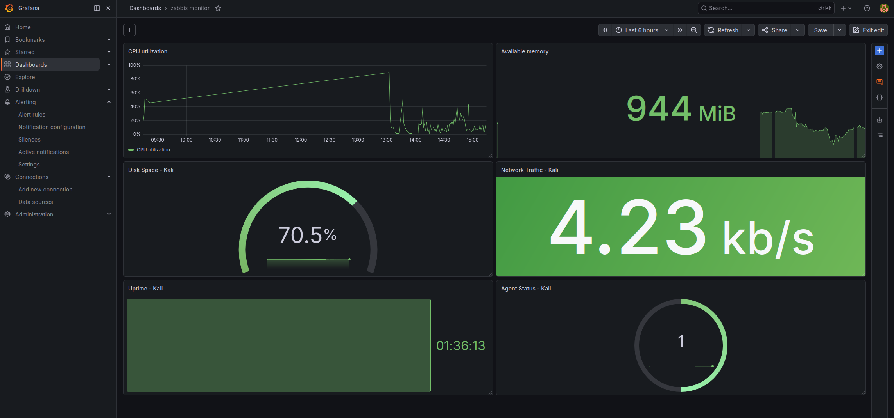
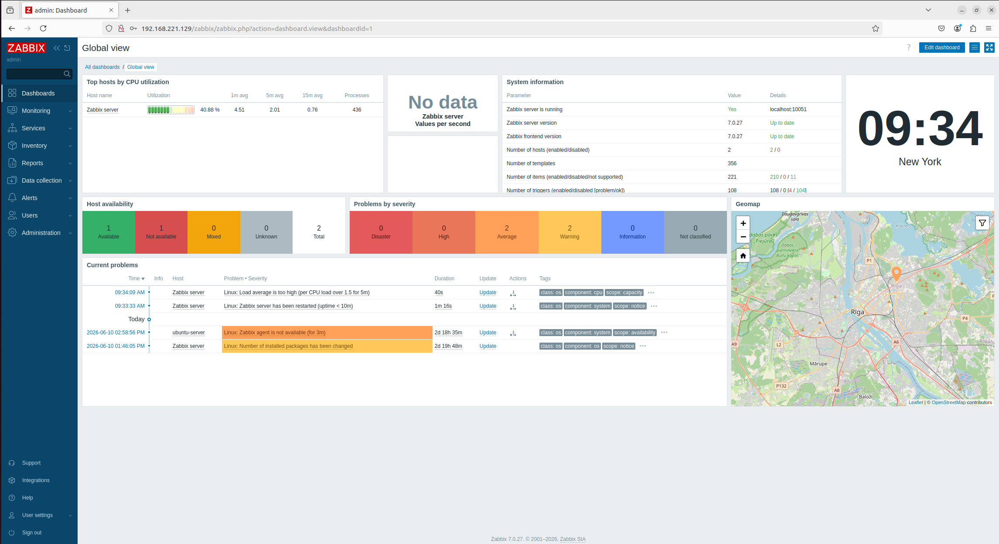
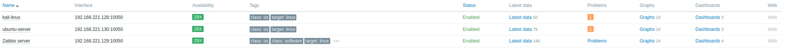
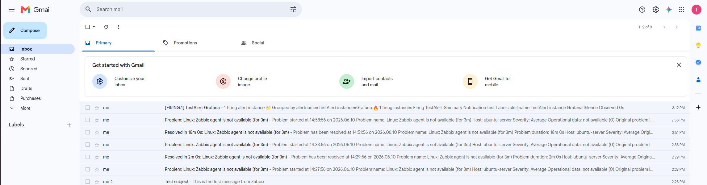
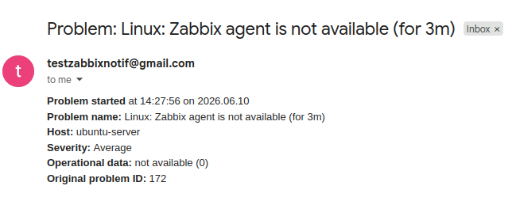

# Network Monitoring and Visualization with Zabbix & Grafana

## Overview
A network and system monitoring solution built on a VMware virtualized infrastructure using Zabbix and Grafana. The project includes real-time monitoring, interactive dashboards, and automated email alert notifications.

## Infrastructure

| Machine        | OS            | IP Address       | Role                    |
|----------------|---------------|-------------------|-------------------------|
| Ubuntu Desktop | Ubuntu 22.04  | 192.168.221.129   | Zabbix Server + Grafana |
| Ubuntu Server  | Ubuntu 22.04  | 192.168.221.130   | Zabbix Agent            |
| Kali Linux     | Kali Linux    | 192.168.221.128   | Zabbix Agent            |

All machines are connected on a VMware NAT network (VMnet8).

## Features
- Real-time monitoring of CPU, memory, disk space, and network traffic
- Grafana dashboards for interactive data visualization
- Automated email alerts via Gmail SMTP for critical events
- Grafana alerting rules with custom thresholds
- System uptime and agent availability monitoring

## Tools Used
- Zabbix 7.0
- Grafana
- MariaDB
- VMware Workstation
- Ubuntu 22.04 LTS
- Kali Linux

## Monitored Metrics

| Metric              | Description                              |
|---------------------|-------------------------------------------|
| CPU Utilization      | Real-time CPU usage percentage            |
| Available Memory     | Free RAM in MB                            |
| Disk Space           | Used disk space percentage                |
| Network Traffic      | Incoming and outgoing traffic in bits/sec |
| System Uptime        | How long the machine has been running     |
| Agent Availability    | Zabbix agent connection status            |

## Alert System
- Zabbix triggers configured for critical events
- Gmail SMTP configured for email notifications
- Grafana alert rules set for:
  - CPU usage above 85%
  - Memory below 500MB
  - Disk usage above 90%

## Setup Guide

### Prerequisites
- VMware Workstation installed
- All VMs connected to VMnet8 (NAT)
- Internet access on all VMs

### 1. Database Setup
```bash
sudo apt install -y mariadb-server
sudo systemctl enable --now mariadb
sudo mysql -uroot -p
```
```sql
CREATE DATABASE zabbix CHARACTER SET utf8mb4 COLLATE utf8mb4_bin;
CREATE USER 'zabbix'@'localhost' IDENTIFIED BY 'zabbix123';
GRANT ALL PRIVILEGES ON zabbix.* TO 'zabbix'@'localhost';
FLUSH PRIVILEGES;
EXIT;
```

### 2. Zabbix Server Installation
```bash
wget https://repo.zabbix.com/zabbix/7.0/ubuntu/pool/main/z/zabbix-release/zabbix-release_latest+ubuntu22.04_all.deb
sudo dpkg -i zabbix-release_latest+ubuntu22.04_all.deb
sudo apt update
sudo apt install -y zabbix-server-mysql zabbix-frontend-php zabbix-apache-conf zabbix-sql-scripts zabbix-agent2
zcat /usr/share/zabbix-sql-scripts/mysql/server.sql.gz | mysql -uzabbix -pzabbix123 zabbix
sudo systemctl enable --now zabbix-server zabbix-agent2 apache2
```

### 3. Zabbix Agent Installation (Ubuntu Server & Kali)
```bash
sudo apt install -y zabbix-agent2
sudo nano /etc/zabbix/zabbix_agent2.conf
# Set:
# Server=192.168.221.129
# ServerActive=192.168.221.129
# Hostname=ubuntu-server (or kali-linux)
sudo systemctl enable --now zabbix-agent2
```

### 4. Grafana Installation
```bash
sudo apt install -y grafana
sudo systemctl enable --now grafana-server
sudo grafana-cli plugins install alexanderzobnin-zabbix-app
sudo systemctl restart grafana-server
```

### 5. Email Notifications
- Configure Gmail SMTP in Zabbix: **Alerts → Media types → Email**
- Add email to Admin user: **Administration → Users → Admin → Media**
- Create trigger action: **Alerts → Actions → Trigger actions**

## Screenshots

### Grafana Dashboard


### Zabbix Monitoring Dashboard


### Zabbix Monitoring Hosts


### Email Alert


### Email Alert


## Author
Meher Ben Zakour
